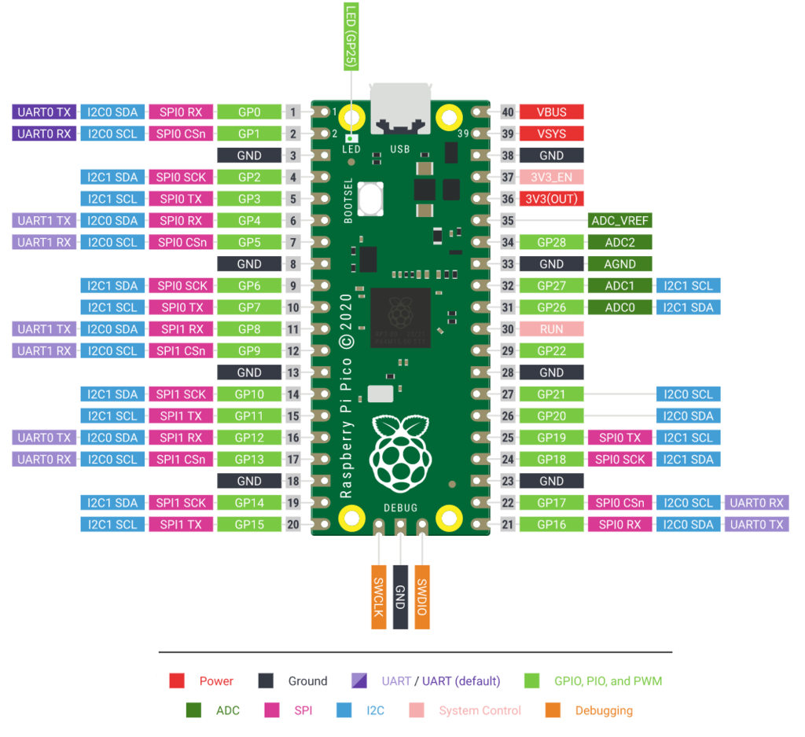

# Robot Arm Controller
3D printed robot arm, controlled with a Raspberry Pi Pico.

The docker container that the code is compiled in was created by [lukestep](https://hub.docker.com/r/lukstep/raspberry-pi-pico-sdk), for more instructions view his repo.

Run the following command in the repos root directory
```bash
docker run -d -it --name pico-sdk --mount type=bind,source=${PWD},target=/home/dev lukstep/raspberry-pi-pico-sdk:latest
```

I have forked the lukestep's repository and added some more tools. To use that instead
clone the repo and the build it. 
```bash
git clone https://github.com/Anton-Augustsson/raspberry-pi-pico-docker-sdk.git
cd raspberry-pi-pico-docker-sdk
docker build . --tag pico-sdk
```

Cd into `robot-arm-controller` and run.
```bash
docker run -d -it --name pico-sdk-aa --mount type=bind,source=${PWD},target=/home/dev pico-sdk:latest
```

## Compile 
You have two options: either you run with the pico library or you use the simulation flag.
So that you may run without hardware. You are thus able to change the environment through
software.

To run with hardware run:
```bash
rm -r build && mkdir build && cd build
cmake -DCMAKE_EXPORT_COMPILE_COMMANDS=1 ..  # or cmake ..
make -j4  # or make
```
Then you have to move the .uf2 file to the pico when it is in boot mode so it can be mounted.

To run with simulation run:
```bash
rm -r build && mkdir build && cd build
cmake -DSIMULATION=ON ..
make
./sample
```

## PWM
Controlling the motors on the robot arm is done my sending a pwm signal to the motors 
on the robot arm.
| Motor   | PWM function | Header Pin | Broadcom pin name |
| ------- | ------------ | ---------- | ----------------- |
| MG996R  | PWM          | 4          | GP2               |
| MG996R  | PWM          | 5          | GP3               |
| MG996R  | PWM          | 6          | GP4               |

There are two models of motors used for the robot arm.
| Model              | PWM Period | Voltage           |
| ------------------ | ---------- | ----------------- |
| [SG90](http://www.ee.ic.ac.uk/pcheung/teaching/DE1_EE/stores/sg90_datasheet.pdf)                 | 50Hz       | 5V                |
| [MG996R](https://cdn.shopify.com/s/files/1/1509/1638/files/Servo_MG996R_Datenblatt.pdf?5470426105647302493) | 50Hz       | 5V                |


## Framework 
Framework is a separate program to experiment the general program structure of a microcontroller.
SPI will be used to communicate with a bare metal controller and a node.


### SPI 
- SCLK: Serial clock
- MOSI: Master Out Slave In; SDI: Serial data in
- MISO: Master In Slave Out; SDO: Serial data out
- CE0: Chip enable 0
- CE1: Chip enable 0

#### Rassbary PI Pico (Slave/Peripheral)
| SPI function | Header Pin | Broadcom pin name | Broadcom pin function |
| ------------ | ---------- | ----------------- | --------------------- |
| MISO         | 25         | GP19              | SPI0 TX               |
| SCLK         | 24         | GP18              | SPI0 SCK              |
| CE0          | 22         | GP17              | SPI0 CSn              |
| MOSI         | 21         | GP16              | SPI0 RX               |
From [Communicating as master and slave via SPI](https://datasheets.raspberrypi.com/pico/raspberry-pi-pico-c-sdk.pdf)



#### Rassbary PI 4 (Master/SPI controller)
| SPI function | Header Pin | Broadcom pin name | Broadcom pin function |
| ------------ | ---------- | ----------------- | --------------------- |
| MOSI         | 19         | GPIO10            | SPI0_MOSI             |
| MISO         | 21         | GPIO09            | SPI0_MISO             |
| SCLK         | 23         | GPIO11            | SPI0_SCLK             |
| CE0          | 24         | GPIO08            | SPI0_CE0_N            |
| CE1          | 26         | GPIO07            | SPI0_CE1_N            |
From [link](https://www.raspberrypi.com/documentation/computers/raspberry-pi.html#serial-peripheral-interface-spi).

From [link](https://www.raspberrypi.com/documentation/computers/raspberry-pi.html).

## Requirement
For src you need to install (nlohmann/json)[https://github.com/nlohmann/json/tree/develop?tab=readme-ov-file#integration], which you can do with [vcpkg](https://github.com/Microsoft/vcpkg/?tab=readme-ov-file#quick-start-unix).

## Resources
- [Step 1: A Basic Starting Point](https://cmake.org/cmake/help/latest/guide/tutorial/A%20Basic%20Starting%20Point.html)
- [Google C++ Style Guide](https://google.github.io/styleguide/cppguide.html)

### PICO SDK
- [Raspberry Pi Pico C/C++ SDK](https://datasheets.raspberrypi.com/pico/raspberry-pi-pico-c-sdk.pdf)
- [Getting started with Raspberry Pi Pico](https://datasheets.raspberrypi.com/pico/getting-started-with-pico.pdf)
- [Making Two Raspberry Pi Pico Boards Communicate through SPI using C/C++ SDK](https://www.circuitstate.com/tutorials/making-two-raspberry-pi-pico-boards-communicate-through-spi-using-c-cpp-sdk/)

### Linux driver for SPI peripheral
- [SPI – Serial Peripheral Interface Protocol Basics](https://embetronicx.com/tutorials/tech_devices/spi-serial-peripheral-interface-protocol-basics/)
- [Linux Device Driver Tutorial – Part 1 | Introduction](https://embetronicx.com/tutorials/linux/device-drivers/linux-device-driver-part-1-introduction/)
- [Serial Peripheral Interface (SPI)](https://www.kernel.org/doc/html/v4.13/driver-api/spi.html)
- [Device Tree for Dummies](https://elinux.org/images/f/f9/Petazzoni-device-tree-dummies_0.pdf)

